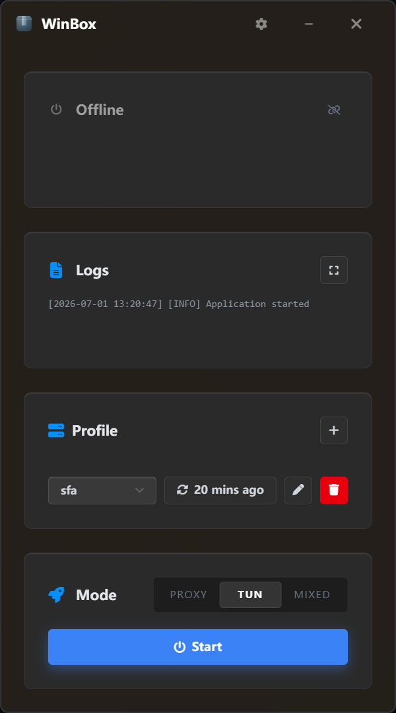

#  WinBox

A minimal, modern, and highly optimized Windows GUI for [Sing-box](https://github.com/SagerNet/sing-box), engineered with [Wails](https://wails.io) and Vue 3.

<div align="center">
  
</div>
<br>

 

## Overview

WinBox is designed to provide a seamless and professional proxy management experience on Windows. It combines a robust Go backend with a modern, lightweight frontend, prioritizing stability, performance, and automation.

## Key Features

* **Smart Auto-Connect**: Intelligent state management that automatically detects system network connectivity. The proxy kernel seamlessly connects and disconnects based on your actual network availability, ensuring a truly hands-free experience.
* **Zero-Configuration Kernel**: Fully automated provisioning. WinBox detects your system architecture (AMD64/ARM64) and automatically downloads, installs, and updates the correct Sing-box core without manual intervention.
* **UWP Loopback Manager**: Includes a built-in exemption manager to grant Windows UWP applications (e.g., Microsoft Store apps) local loopback access, effortlessly bypassing Windows AppContainer isolation.
* **High-Performance Architecture**: Features a zero-overhead, event-driven logging system that streams core outputs to the frontend without polling delays or memory leaks. The application is compiled with advanced optimization flags for a drastically reduced binary footprint.
* **Modern Design System**: Crafted following WinUI 3 principles. It features an adaptive Light/Dark mode and utilizes a premium, high-contrast color palette inspired by Radix UI, delivering a professional and native Windows 11 aesthetic.
* **Dual Routing Modes**: Seamlessly toggle between TUN Mode (Virtual Network Interface) and System Proxy Mode to suit varying network requirements.
* **Silent Execution**: Optimized background process handling allows for a completely silent, window-free startup alongside Windows boot.

## Installation

1. Navigate to the [Releases](../../releases) page.
2. Download the latest `WinBox.exe`.
3. **Run the executable.**
   *Note: TUN mode requires the application to be launched with Administrator privileges to manage virtual network interfaces.*

## Quick Start

1. **First Initialization**: Navigate to **Settings**. If operating in a restricted network environment, enable the **GitHub Mirror** option. Click **"Check Updates"** to automatically provision the Sing-box kernel.
2. **Import Profiles**: Open the "Profiles" drawer to add and manage your subscription URLs.
3. **Connect**: Toggle **TUN Mode** or **System Proxy** directly from the main dashboard.

## Build from Source

**Prerequisites:**
* [Go](https://go.dev/) (1.21+)
* [Node.js](https://nodejs.org/) (18+)
* [Wails CLI](https://wails.io/docs/gettingstarted/installation)

**Build Instructions:**

```bash
# 1. Clone the repository
git clone https://github.com/YourUsername/WinBox.git
cd WinBox

# 2. Build the application (Production build)
wails build -clean -ldflags "-s -w" -trimpath
```