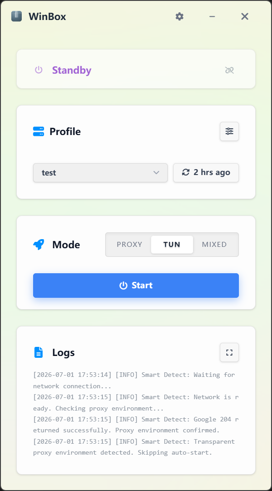
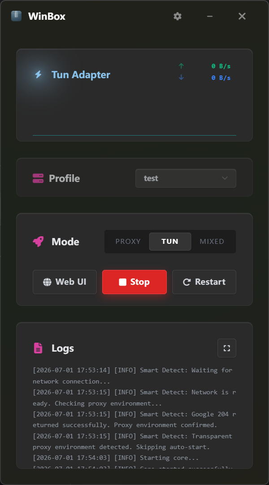

#  WinBox

 

A minimal, modern, and highly optimized Windows GUI for [Sing-box](https://github.com/SagerNet/sing-box), engineered with [Tauri 2](https://tauri.app), Rust, React, and Microsoft Fluent UI.

<div align="center">
  
  
</div>

## Overview

WinBox is designed to provide a seamless and professional proxy management experience on Windows. It combines a Rust backend with a modern, lightweight frontend, prioritizing stability, performance, and automation.

## Key Features

* **Smart Auto-Connect**: Intelligent state management that automatically detects system network connectivity. The proxy kernel seamlessly connects and disconnects based on your actual network availability, ensuring a truly hands-free experience.
* **Zero-Configuration Kernel**: Fully automated provisioning for Windows AMD64/x64. WinBox downloads, installs, and updates the matching Sing-box core without manual intervention.
* **UWP Loopback Manager**: Includes a built-in exemption manager to grant Windows UWP applications (e.g., Microsoft Store apps) local loopback access, effortlessly bypassing Windows AppContainer isolation.
* **High-Performance Architecture**: Features a zero-overhead, event-driven logging system that streams core outputs to the frontend without polling delays or memory leaks. The application is compiled with advanced optimization flags for a drastically reduced binary footprint.
* **Modern Design System**: Crafted following WinUI 3 principles. It features an adaptive Light/Dark mode and utilizes a premium, high-contrast color palette inspired by Radix UI, delivering a professional and native Windows 11 aesthetic.
* **Dual Routing Modes**: Seamlessly toggle between TUN Mode (Virtual Network Interface) and System Proxy Mode to suit varying network requirements.
* **Silent Execution**: Optimized background process handling allows for a completely silent, window-free startup alongside Windows boot.

## Installation

1. Navigate to the [Releases](https://github.com/Leovikii/WinBox/releases) page.
2. Download the Windows AMD64/x64 NSIS installer and confirm the installation. It uses the default `C:\Program Files\WinBox\` location and does not require a path or component choice.
3. The installer starts WinBox automatically after installation.
   *Note: WinBox currently requests Administrator privileges at startup.*

WinBox stores user data outside the installation directory, normally at
`%LOCALAPPDATA%\com.leovikii.winbox\`. Updates replace application files only.
The installation directory contains only the application and installer-generated
runtime/uninstall files; profiles, settings, logs and the sing-box core stay in
the data directory.
The installer does not automatically migrate data from the old single-file
portable version. Old portable users should follow the backup and copy steps below to keep
their profiles and settings.

For a manual upgrade from the old portable version:

1. Exit the old WinBox completely and back up its `data` directory.
2. Install the NSIS version; if it starts automatically, exit it before setup.
3. Confirm the new data directory has no user data, then copy the contents of
   the old `data` directory into `%LOCALAPPDATA%\com.leovikii.winbox\`.
4. Keep the backup until the new installation has been verified.

## Quick Start

1. **First Initialization**: Navigate to **Settings**. If operating in a restricted network environment, enable the **GitHub Mirror** option. Click **"Check Updates"** to automatically provision the Sing-box kernel.
2. **Import Profiles**: Open the "Profile" manager to add and manage your subscription URLs.
3. **Connect**: Select **Proxy**, **TUN**, or **Mixed**, then click **Start**.

## Build from Source

**Prerequisites:**
* [Rust](https://www.rust-lang.org/tools/install) (1.97+, Windows x64 MSVC toolchain and Visual Studio C++ Build Tools)
* [Node.js](https://nodejs.org/) (20.19+ on Node 20, or 22.12+)
* WebView2 Runtime
* [Tauri CLI](https://v2.tauri.app/start/prerequisites/)

**Build Instructions:**

```bash
# 1. Clone the repository
git clone https://github.com/Leovikii/WinBox.git
cd WinBox

# 2. Install frontend dependencies and build the frontend
npm ci --prefix frontend
npm --prefix frontend run build

# 3. Install the pinned CLI, then build the x64 NSIS installer for local testing
cargo install tauri-cli --version 2.11.4 --locked
cargo tauri build --target x86_64-pc-windows-msvc --bundles nsis --no-sign
```

Pull requests to `main` build the unsigned x64 NSIS installer for validation.
After merge, GitHub Actions signs and publishes the NSIS installer and the
official Tauri updater artifacts. Local test executables are never used as
release inputs. This release line does not publish portable, MSI or ARM64
artifacts.

The in-app updater uses the existing pre-release setting when checking release
metadata; no separate update channel is created.

The backend and React + Fluent UI migrations are complete. After manual testing,
the maintainer closed the refactor phase on 2026-09-22. Version `3.0.0-alpha.2`
is ready for the maintainer's `dev` → `main` pull request; publication follows the
existing signed release workflow.

Development guides: [Architecture](docs/architecture.md),
[Frontend design](docs/frontend.md), [Backend contracts](docs/backend.md),
[Testing and release](docs/development.md). AI agents start with [AGENTS.md](AGENTS.md).
