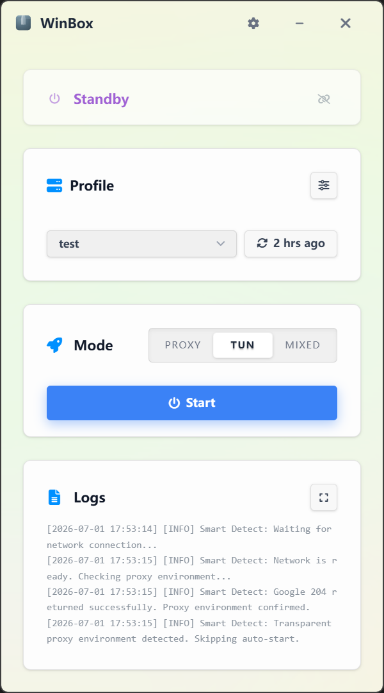
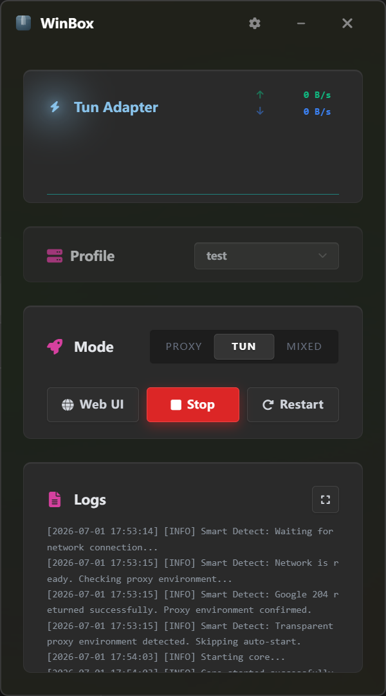

#  WinBox

A Windows desktop client for [sing-box](https://github.com/SagerNet/sing-box), with a Fluent interface and simple proxy controls.

**[Download for Windows x64](https://github.com/Leovikii/WinBox/releases)** · [User guide](docs/usage.md) · [Report an issue](https://github.com/Leovikii/WinBox/issues)

  
  

## Features

- **Three connection modes** — Proxy, TUN, and Mixed (TUN + system proxy).
- **Smart auto-connect** — Checks network access and connects when needed. Start minimized at sign-in, or choose Always / Off.
- **Profiles and updates** — Manage subscription URLs and download or update the sing-box core from the app.
- **Fluent design** — Light, dark, and system themes, with live traffic and connection logs.
- **UWP support** — Manage loopback exemptions for Microsoft Store apps.

## Get started

1. Download and run the **Windows x64 installer** from [Releases](https://github.com/Leovikii/WinBox/releases). WinBox installs for your Windows account and opens automatically.
2. Open **Settings** and download the sing-box core using **Download**. If downloads cannot connect, configure **Download proxy**.
3. Open the **Profile** manager, add your subscription URL, and select the profile.
4. Choose **Proxy**, **TUN**, or **Mixed**, then click **Start**. Use **Stop** to disconnect.

TUN, Mixed, and UWP changes require administrator approval using the same Windows account. WinBox otherwise starts without administrator privileges.

## Everyday use

- Set auto-connect and sign-in startup in **Settings**. If automatic connection needs authorization, open WinBox and approve it manually.
- Check for app and core updates in **Settings**. Enable **Pre-release updates** to receive beta releases.
- To fully exit, choose **Quit** from the tray menu.
- Updates preserve your data. When uninstalling, clear **Delete app data** if you want to keep profiles and settings.

For data locations, permissions, or upgrading from older alpha versions, see the [user guide](docs/usage.md).

[MIT License](LICENSE)
